<h1 align="center"><code>🛰️ Overhead (Satellite/Drone) Image Analysis</code></h1>

<p align="center">
  
</p>

<p align="center">
  
  
  
  
  
</p>

> End-to-end deep learning pipeline for **building footprint extraction** from satellite and drone imagery — spanning 8-band multispectral training (SpaceNet-1), 3-band RGB evaluation, and full cross-domain transfer learning to Indian drone imagery (Svamitva). Three architectures compared: custom U-Net, fine-tuned SAM ViT-B, and YOLOv8-Nano.

📓 [oiu-sd Notebook](notebooks/oiu-sd.ipynb) · 📓 [SpaceNet1 Eval Notebook](notebooks/spacenet1-unet-sam-3band-evaluation.ipynb) · 🗃️ [Dataset Links](data/dataset_links.md)

---

## 📋 Table of Contents

- [Project Overview](#project-overview)
- [Repository Structure](#repository-structure)
- [Datasets](#datasets)
- [Model Architectures](#model-architectures)
- [Pipeline](#pipeline)
- [Results](#results)
- [Environment & Setup](#environment--setup)
- [Notebook Walkthroughs](#notebook-walkthroughs)
- [Output Files](#output-files)
- [Contributors](#contributors)
- [References](#references)

---

## Project Overview

This project implements and compares multiple deep learning architectures for semantic segmentation of building footprints across two distinct image domains:

- **Phase 1 Evaluation (`spacenet1-unet-sam-3band-evaluation.ipynb`):** Train and benchmark a 3-band U-Net against SAM zero-shot on Kaggle with pre-generated masks, no Google Drive dependency
- **Phase 1 — Satellite Imagery (`oiu-sd.ipynb`):** Train a custom 8-channel U-Net and fine-tune SAM ViT-B on SpaceNet-1 WorldView-3 multispectral imagery
- **Phase 2 — Transfer Learning (`oiu-sd.ipynb`):** Apply network surgery to adapt both models from 8-band satellite to 3-band drone imagery, then fine-tune and evaluate alongside YOLOv8-Nano

---

## Repository Structure

```
overhead-satellite-image-analysis/
├── data/
│   └── dataset_links.md                             # Download links & storage info
├── notebooks/
│   ├── oiu-sd.ipynb                                 # Main pipeline: 8-band U-Net + SAM + YOLO (Phases 1 & 2)
│   ├── spacenet1-unet-sam-3band-evaluation.ipynb    # 3-band U-Net training & U-Net vs SAM evaluation
│   └── spacenet1_full_download.ipynb                # Dataset download utility
├── .gitignore
├── README.md
└── requirements.txt
```

---

## Datasets

### SpaceNet-1 (Phase 1 — Satellite)

| Property | Details |
|---|---|
| Region | Rio de Janeiro, Brazil |
| Sensor | WorldView-3 |
| Bands | 8-band multispectral (`oiu-sd`) · 3-band RGB (`spacenet1-eval`) |
| Tiles | ~6,940 paired GeoTIFF + GeoJSON |
| Resolution | 438 × 406 px native → resized to 400×400 / 512×512 |
| Annotations | GeoJSON building footprints → rasterized binary masks |
| Official | [spacenet.ai/spacenet-buildings-dataset-v1](https://spacenet.ai/spacenet-buildings-dataset-v1/) |
| AWS | `s3://spacenet-dataset/spacenet/SN1_buildings/tarballs/` |
| Kaggle (8-band) | `ishangain/spacenet-1` |
| Kaggle (3-band + masks) | `sayanmondal772/spacenet1-3band-masks` |

### Svamitva Drone (Phase 2 — Transfer Target)

| Property | Details |
|---|---|
| Region | Rural/peri-urban India |
| Sensor | Drone aerial camera |
| Bands | 3-band RGB |
| Annotations | Pre-generated binary building masks (FilteredData) |
| Kaggle | `utkarshsaxenadn/svamitva-drone-aerial-images` |

> All datasets stored externally. See [`data/dataset_links.md`](data/dataset_links.md) for the full list of downloaded files.

---

## Model Architectures

### 🔷 U-Net (8-channel & 3-channel)

A from-scratch encoder-decoder with skip connections, built for both 8-band multispectral and 3-band RGB input.

```
Input: (B, 8 or 3, H, W)
  │
  ├─ Encoder:     [64 → 128 → 256 → 512]   (DoubleConv + MaxPool)
  ├─ Bottleneck:  1024
  └─ Decoder:     [512 → 256 → 128 → 64]   (ConvTranspose2d + skip concat)
  │
Output: (B, 1, H, W)  — logits
```

| Component | Detail |
|---|---|
| Input channels | 8 (Phase 1) → 3 (Phase 2, via network surgery) |
| Feature maps | [64, 128, 256, 512] |
| Loss | BCEWithLogitsLoss (Phase 1) · BCEDiceLoss pos_weight=5.0 (Phase 2) |
| Optimizer | Adam (lr=1e-4) |
| Augmentation | H/V flip, 90° rotation, brightness/contrast jitter |
| Multi-GPU | DataParallel (2× T4) |
| Checkpoint | Auto-resume from `unet_last.pth` |

### 🔶 SAM ViT-B Fine-Tuner

Meta's Segment Anything Model adapted for multispectral satellite and drone imagery.

```
Input: (B, 8 or 3, 1024, 1024)
  │
  ├─ channel_adapter:  Conv2d(8→3) + BN      [LEARNABLE]
  ├─ image_encoder:    ViT-B                 [FROZEN]
  ├─ prompt_encoder:                         [FROZEN]
  └─ mask_decoder:                           [TRAINABLE ~4.1M params]
  │
Output: (B, 1, H, W)  — logits
```

| Component | Detail |
|---|---|
| Base model | SAM ViT-B (`sam_vit_b_01ec64.pth`, ~375 MB) |
| Trainable params | ~4.1M (mask decoder only) |
| Loss | BCEWithLogitsLoss |
| Optimizer | Adam (lr=1e-4 Phase 1 · lr=1e-5 Phase 2) |
| Forward pass | Micro-batched (1 sample at a time) to prevent OOM |
| Phase 2 surgery | `channel_adapter` replaced: Conv2d(8→3) → Conv2d(3→3) |
| Zero-shot mode | `SamAutomaticMaskGenerator` (points_per_side=16, building area/aspect filter) |

### 🟢 YOLOv8-Nano (Segmentation)

Ultralytics YOLOv8-Nano applied to drone imagery as a lightweight comparison baseline.

| Component | Detail |
|---|---|
| Architecture | YOLOv8-Nano segmentation head |
| Label format | YOLO normalized polygons (OpenCV contour extraction from binary masks) |
| Dataset | Built dynamically from `drone_train_loader` PyTorch batches |
| Training | Ultralytics `YOLO.train()` API |

---

## Pipeline

### Phase 1 Evaluation — `spacenet1-unet-sam-3band-evaluation.ipynb` (3-band)

```
Kaggle Dataset (3-band RGB + pre-generated masks)
        │
        ├─► Dynamic Path Discovery (handles split zip folders)
        │
        ├─► Dataset Exploration & Visualisation
        │
        ├─► SpaceNetDataset + DataLoaders (Albumentations augmentation)
        │
        ├─► U-Net (3ch) Training (BCEDiceLoss, DataParallel, auto-resume)
        │
        ├─► Full Evaluation
        │        ├─ Loss & IoU curves
        │        ├─ Pixel-level: IoU / Precision / Recall / F1
        │        ├─ Confusion matrix
        │        ├─ Per-image IoU distribution
        │        └─ Prediction grid + polygon overlay (OpenCV)
        │
        └─► SAM Zero-Shot Inference & U-Net vs SAM Comparison
```

### Phase 1 — SpaceNet-1 · `oiu-sd.ipynb` (8-band)

```
Raw 8-band GeoTIFFs + GeoJSON annotations
        │
        ├─► File Pairing by Image ID (regex sweep, skip 3-band/metadata dirs)
        │
        ├─► Binary Mask Generation
        │        └─ rasterio.features.rasterize(GeoJSON → binary TIF)
        │
        ├─► SpaceNet8BandDataset + DataLoaders (400×400, batch=8)
        │
        ├─► SAM ViT-B Zero-Shot Baseline
        │
        ├─► U-Net (8ch) Training
        │        ├─ BCEWithLogitsLoss, Adam, DataParallel
        │        └─ Best-model checkpointing
        │
        ├─► U-Net Evaluation (IoU, Dice, Precision, Recall)
        │
        ├─► SAM Fine-Tuning
        │        ├─ Frozen encoder + prompt encoder
        │        ├─ Micro-batched forward pass
        │        └─ Mask decoder only
        │
        └─► SAM Evaluation + Confusion Matrices
```

### Phase 2 — Svamitva Drone · `oiu-sd.ipynb` (Transfer Learning)

```
Pre-trained 8-band U-Net + SAM (Phase 1 checkpoints)
        │
        ├─► Network Surgery (8-band → 3-band)
        │        ├─ U-Net: replace input Conv2d(8→64) with Conv2d(3→64)
        │        └─ SAM: replace channel_adapter Conv2d(8→3) with Conv2d(3→3)
        │
        ├─► Zero-Shot Transfer Test (sanity check)
        │
        ├─► Svamitva DroneDataset + DataLoaders
        │
        ├─► U-Net Phase 2 Fine-Tuning (lr=1e-4, 10 epochs, BCEDiceLoss)
        │        └─ + OpenCV Polygon Post-processing
        │
        ├─► SAM Phase 2 Micro-Batched Fine-Tuning (lr=1e-5)
        │
        ├─► YOLO Dataset Builder
        │        └─ Binary mask → OpenCV contours → YOLO normalized polygons
        │
        ├─► YOLOv8-Nano Training (Ultralytics API)
        │
        └─► Comparative Evaluation: U-Net · SAM · YOLO (confusion matrices)
```

---

## Results

---

### Phase 1 — SpaceNet-1 · 3-band (`spacenet1-unet-sam-3band-evaluation.ipynb`)

Evaluated on the SpaceNet-1 validation set using 3-band RGB imagery with pre-generated masks.

#### Sample RGB Tile & Mask
<p align="center">
  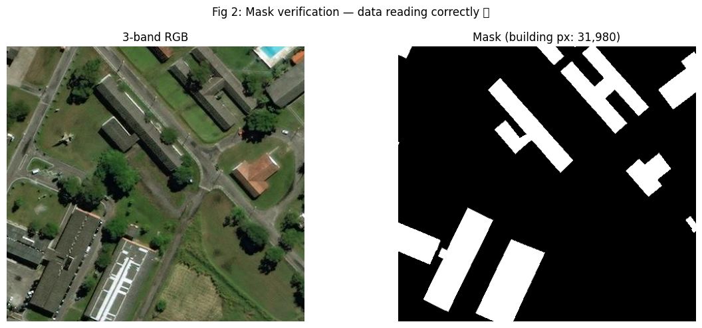
</p>

#### Model Metrics

| Model | Mean IoU | F1 Score | Precision | Recall |
|---|---|---|---|---|
| SAM ViT-B (zero-shot) | ~0.10 | — | — | — |
| **U-Net (3-band, trained)** | **0.631** | **0.724** | 0.601 | 0.910 |

#### Training — Loss & IoU Curves
<p align="center">
  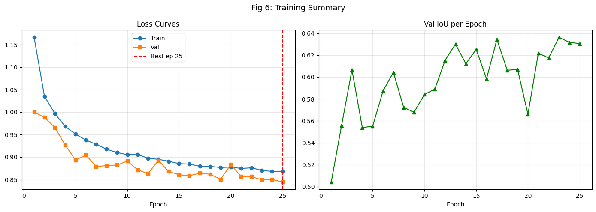
</p>

#### U-Net Prediction Grid (RGB · Ground Truth · Predicted)
<p align="center">
  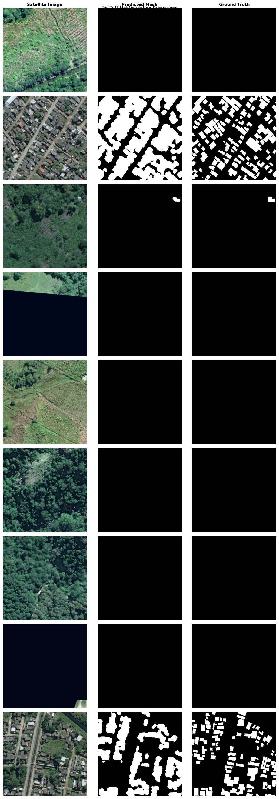
</p>

#### U-Net Confusion Matrix
<p align="center">
  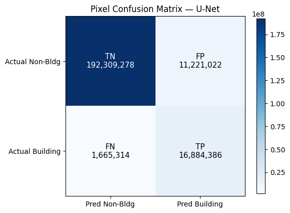
</p>

#### Per-Image IoU Distribution — U-Net
<p align="center">
  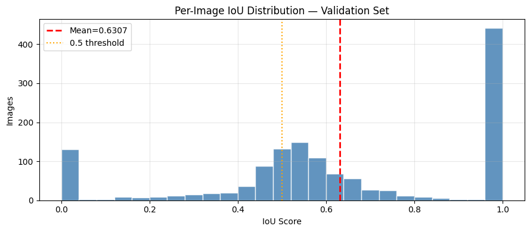
</p>

#### Per-Image IoU Distribution — SAM Zero-Shot
<p align="center">
  
</p>

#### U-Net vs SAM — Metric Comparison
<p align="center">
  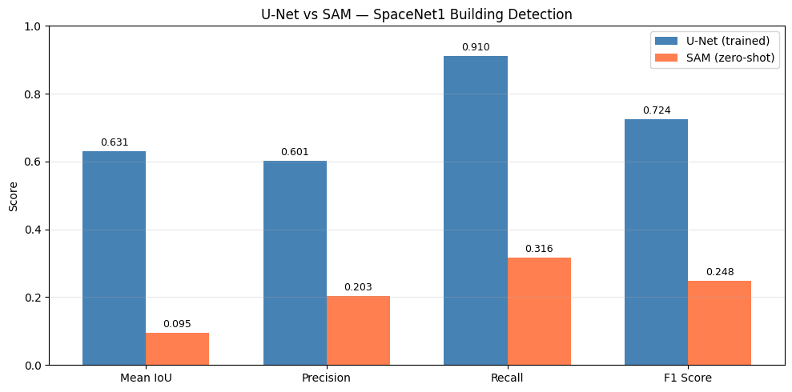
</p>

---

### Phase 1 — SpaceNet-1 · 8-band (`oiu-sd.ipynb`)

Evaluated on the SpaceNet-1 test set using 8-band WorldView-3 multispectral imagery.

#### Sample 8-band Tile & Generated Mask
<p align="center">
  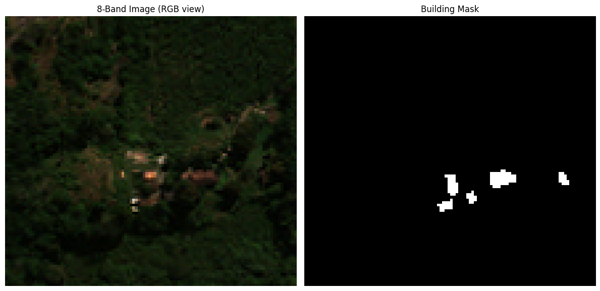
</p>

#### Model Metrics

| Model | Mean IoU | F1 / Dice | Precision | Recall |
|---|---|---|---|---|
| SAM ViT-B (zero-shot) | 0.0658 | 0.1235 | 0.0661 | 0.9394 |
| SAM ViT-B (fine-tuned) | 0.4355 | 0.4755 | 0.8375 | 0.4560 |
| **U-Net (8-band, trained)** | **0.6126** | **0.7029** | **0.8358** | **0.6805** |

> SAM zero-shot achieves near-perfect recall but extremely low precision — it over-segments everything. The trained U-Net is the strongest performer on Phase 1. Fine-tuned SAM improves substantially over zero-shot but still trails U-Net on IoU and F1.

#### SAM Zero-Shot Segmentation
<p align="center">
  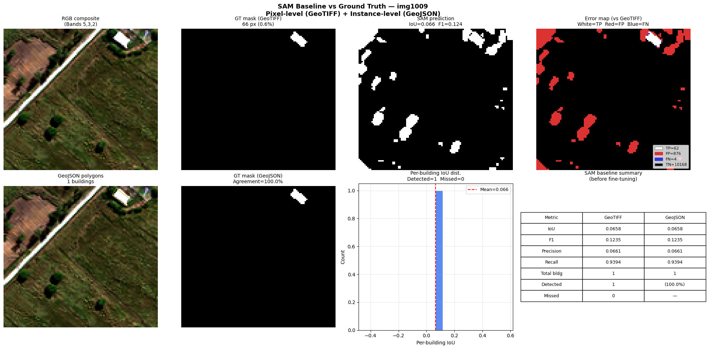
</p>

#### U-Net Predictions vs Ground Truth
<p align="center">
  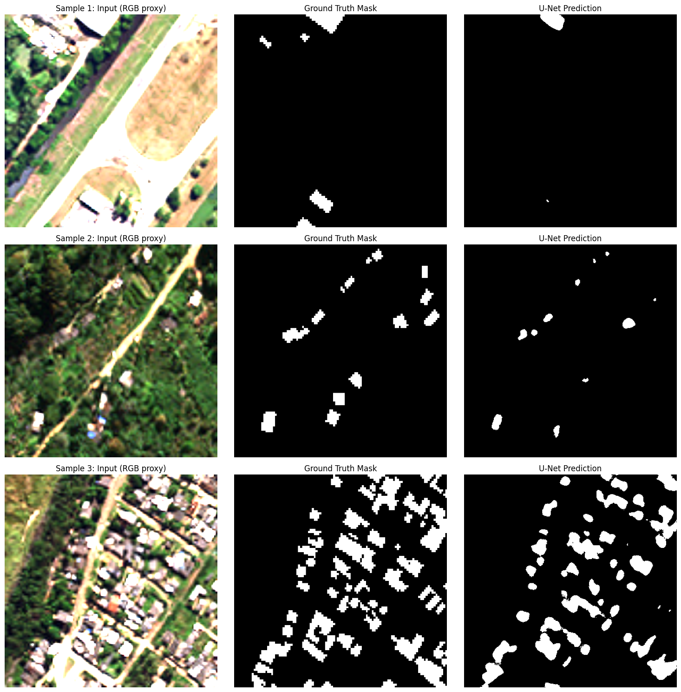
</p>

#### SAM Fine-tuned Predictions vs Ground Truth
<p align="center">
  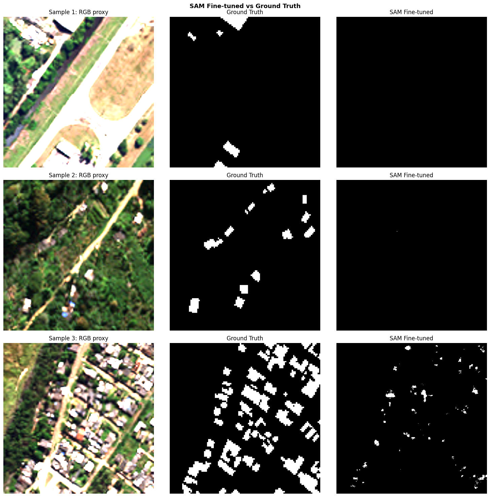
</p>

---

### Phase 2 — Svamitva Drone Dataset (`oiu-sd.ipynb`)

Evaluated pixel-level on Indian drone imagery after cross-domain transfer learning. All models adapted via network surgery (8-band → 3-band) and fine-tuned on the Svamitva dataset.

#### Sample Drone Images & Masks
<p align="center">
  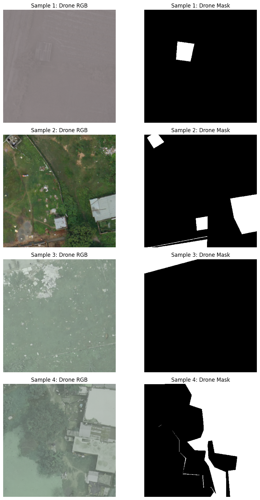
</p>

#### Model Metrics

| Model | Overall Accuracy | Building Precision | Building Recall | Notes |
|---|---|---|---|---|
| **U-Net (fine-tuned)** | **0.92** | **0.91** | **0.89** | Best overall performance |
| U-Net + OpenCV Pipeline | 0.91 | 0.89 | 0.88 | Polygon regularisation post-processing |
| YOLOv8-Nano | 0.86 | 0.86 | 0.76 | Highest building precision after U-Net |
| SAM ViT-B (fine-tuned) | 0.84 | 0.78 | 0.85 | Micro-batched fine-tuning |

#### Pixel-Level Confusion Matrix Summary

| Model | TN | FP | FN | TP |
|---|---|---|---|---|
| U-Net (fine-tuned) | 43,616,038 | 2,653,567 | 3,415,642 | 27,114,753 |
| U-Net + OpenCV | 43,022,354 | 3,369,522 | 3,701,038 | 26,707,086 |
| SAM ViT-B (fine-tuned) | 38,894,930 | 7,456,257 | 4,623,793 | 25,825,020 |
| YOLOv8-Nano | 42,690,745 | 3,630,954 | 7,291,282 | 23,187,019 |

#### U-Net Predictions on Drone Data
<p align="center">
  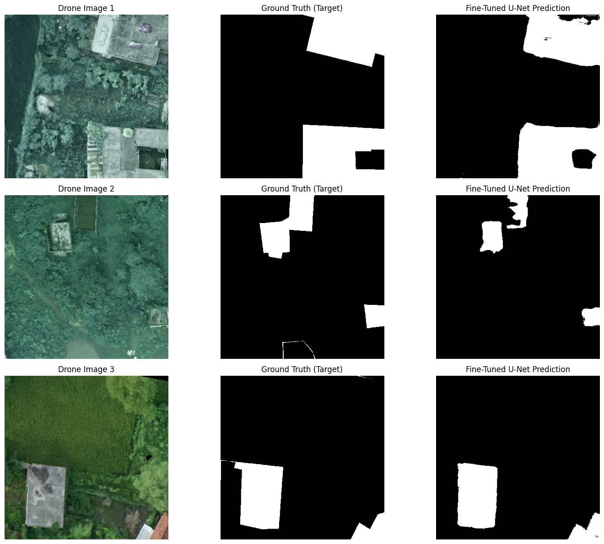
</p>

#### U-Net Confusion Matrix (Phase 2)
<p align="center">
  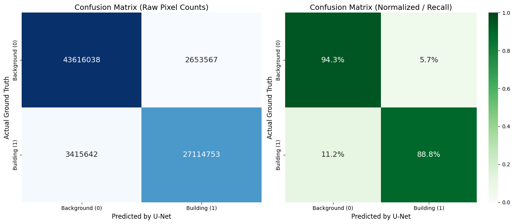
</p>

#### U-Net + OpenCV Pipeline Confusion Matrix
<p align="center">
  
</p>

#### SAM Fine-tuned Predictions on Drone Data
<p align="center">
  
</p>

#### YOLOv8-Nano Predictions on Drone Data
<p align="center">
  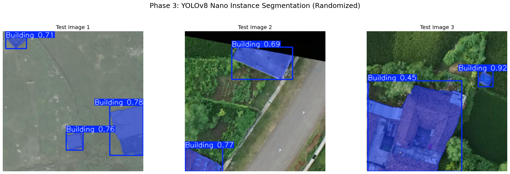
</p>

#### YOLOv8-Nano Confusion Matrix
<p align="center">
  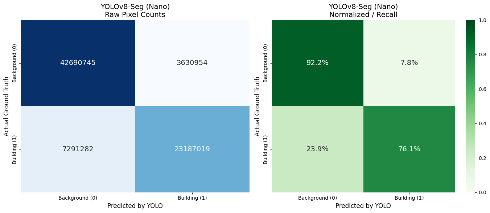
</p>

---

## Environment & Setup

### Requirements

```bash
pip install torch torchvision rasterio geopandas shapely fiona \
            albumentations segment-anything ultralytics \
            opencv-python scikit-learn matplotlib seaborn tqdm
```

Or install from the project file:

```bash
pip install -r requirements.txt
```

### SAM Checkpoint

```python
import urllib.request, os
os.makedirs('checkpoints', exist_ok=True)
urllib.request.urlretrieve(
    'https://dl.fbaipublicfiles.com/segment_anything/sam_vit_b_01ec64.pth',
    'checkpoints/sam_vit_b_01ec64.pth'
)
```

### Kaggle Datasets

| Notebook | Dataset Slug |
|---|---|
| `oiu-sd` | `ishangain/spacenet-1` |
| `oiu-sd` | `utkarshsaxenadn/svamitva-drone-aerial-images` |
| `spacenet1-eval` | `sayanmondal772/spacenet1-3band-masks` |

---

## Notebook Walkthroughs

### `spacenet1-unet-sam-3band-evaluation.ipynb`

| Step | Description |
|---|---|
| 1 | GPU check (`nvidia-smi`, `torch.cuda.device_count()`) |
| 2 | Install dependencies |
| 3 | Config & dynamic path discovery (handles split zip folders) |
| 4 | Dataset exploration — resolution, CRS, band stats, sample visualisation |
| 5 | Path helpers — `geojson_for_image()`, `mask_path_for_image()` |
| 6 | Quick sanity visualisation (RGB tile + binary mask) |
| 7 | `SpaceNetDataset`, train/val/test split, Albumentations transforms |
| 8 | U-Net architecture (3-band, `DoubleConv`, encoder-decoder, skip connections) |
| 9 | `BCEDiceLoss` and Adam optimizer |
| 10 | Training loop with auto-resume checkpoint |
| 11a | Loss & IoU curves |
| 11b | Full val-set evaluation (IoU, Precision, Recall, F1) |
| 11c | Confusion matrix |
| 11d | Per-image IoU distribution histogram |
| 11e | Prediction grid (9 samples: RGB / GT / Predicted) |
| 11f | Polygon contour overlay (OpenCV) |
| 12 | SAM download + `SamAutomaticMaskGenerator` zero-shot inference |
| 12+ | U-Net vs SAM bar chart & IoU distribution comparison |

### `oiu-sd.ipynb` — Phase 1 (SpaceNet-1, 8-band)

| Cell | Description |
|---|---|
| 0 | File pairing: sweep SpaceNet-1 dir, match 8-band GeoTIFF ↔ GeoJSON by image ID |
| 1 | `create_binary_mask()` — rasterize GeoJSON polygons to binary TIF |
| 2–3 | Generate masks for first 10 (test), then all ~6,940 images |
| 4 | Visualise 8-band image + generated mask |
| 5 | `SpaceNet8BandDataset` & DataLoaders (train/val/test, batch=8) |
| 6–7 | SAM install + checkpoint download |
| 8 | SAM zero-shot baseline on a sample 8-band image |
| 9 | `SAMFineTuner` — channel_adapter + frozen ViT-B + trainable decoder |
| 10 | `DiceLoss` and `BCEDiceLoss` definitions |
| 11 | SAM zero-shot vs ground truth visualisation |
| 12 | Metrics: `compute_metrics()` (IoU, F1, Precision, Recall) |
| 13 | U-Net 8-channel architecture |
| 14 | U-Net training loop (DataParallel, checkpointing) |
| 15 | U-Net evaluation on test set |
| 16 | SAM fine-tuning (frozen encoder, mask decoder only, micro-batched) |
| 17 | SAM evaluation on test set |
| 18 | SAM diagnostic heatmap peek |

### `oiu-sd.ipynb` — Phase 2 (Svamitva, Transfer Learning)

| Cell | Description |
|---|---|
| 19 | `DroneDataset` + DataLoader for Svamitva filtered data |
| 20 | Batch visualiser — RGB drone images + binary masks |
| 21 | Network surgery: replace input channels (8→3) for U-Net and SAM |
| 22 | Zero-shot transfer test (satellite models → drone data) |
| 23 | U-Net Phase 2 fine-tuning (BCEDiceLoss, lr=1e-4, 10 epochs) |
| 24 | U-Net post-fine-tuning visualisation on drone data |
| 25–26 | U-Net pixel-level confusion matrix + classification report |
| 27 | OpenCV polygon regularisation on U-Net predictions |
| 28 | Final metrics: U-Net + OpenCV pipeline |
| 29 | SAM micro-batched Phase 2 fine-tuning |
| 30 | SAM fine-tuned visualisation |
| 31–32 | SAM confusion matrix + classification report |
| 33 | YOLO dataset builder (mask → contours → YOLO labels) |
| 34 | YOLOv8-Nano training via Ultralytics API |
| 35 | YOLOv8 inference visualisation |
| 36–38 | YOLOv8 pixel-level evaluation + confusion matrix |

---

## Output Files

### `spacenet1-unet-sam-3band-evaluation.ipynb`

| File | Description |
|---|---|
| `fig1_sample_tile.png` | Sample RGB tile visualisation |
| `fig2_mask_verify.png` | Mask sanity check |
| `fig6_loss_curves.png` | Train/val loss + IoU curves |
| `confusion_matrix.png` | U-Net pixel-level confusion matrix |
| `iou_distribution.png` | Per-image IoU histogram (U-Net) |
| `fig7_predictions.png` | 9-sample prediction grid |
| `fig8_polygons.png` | Polygon contour overlay |
| `fig_unet_vs_sam.png` | U-Net vs SAM metric comparison bar chart |
| `fig11_sam_iou_distribution.png` | Per-image IoU histogram (SAM) |
| `unet_best.pth` | Best U-Net checkpoint (by val loss) |
| `unet_last.pth` | Last epoch checkpoint (for resumption) |

### `oiu-sd.ipynb`

| File | Description |
|---|---|
| `training_masks/` | Generated binary mask TIFs for all ~6,940 SpaceNet-1 tiles |
| `spacenet_unet8ch_best.pth` | Best U-Net checkpoint (Phase 1) |
| `spacenet_sam_best.pth` | Best SAM checkpoint (Phase 1) |
| `yolo_drone_dataset/` | YOLO-format dataset (images + polygon labels) |
| `runs/segment/drone_yolo_project/` | YOLOv8 training run + `best.pt` |
| `checkpoints/sam_vit_b_01ec64.pth` | SAM ViT-B base checkpoint |

---

## Contributors

| GitHub | Name |
|---|---|
| [@IshanGain](https://github.com/IshanGain) | Ishan Gain |
| [@sm7313617-create](https://github.com/sm7313617-create) | Sayan Mondal |
| [@Arka007-hustle](https://github.com/Arka007-hustle) | Pranjal Basu |

---

## References

- [SpaceNet Buildings Dataset v1](https://spacenet.ai/spacenet-buildings-dataset-v1/)
- [Segment Anything Model (SAM)](https://github.com/facebookresearch/segment-anything) — Kirillov et al., 2023
- [YOLOv8](https://github.com/ultralytics/ultralytics) — Ultralytics
- [Svamitva Drone Aerial Images](https://www.kaggle.com/datasets/utkarshsaxenadn/svamitva-drone-aerial-images)
